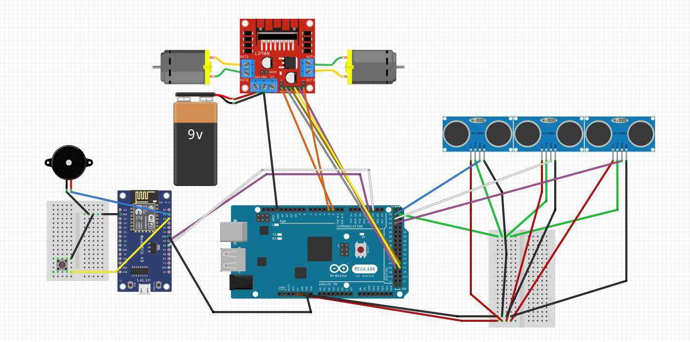

# The Annoying Alarm
The annoying alarm è una sveglia "intelligente" che una volta attivata si muove evitando gli ostacoli fino a quando non viene catturata e spenta.

L'orario della sveglia viene selzionata dall'utente mediante interfaccia web o mediante MQTT.

## Materiale utilizzato
- Arduino Mega
- Esp8266
- Active Buzzer
- 2x Powerbank
- 3x HC-SR04 
- L298N
- Bottone
- Set Macchina (Comprensivo di struttura e due motori DC)
- Batteria 9V

## Liberie Utilizzate
- [L298N](https://github.com/AndreaLombardo/L298N)
- [ESP8266Wifi](https://arduino-esp8266.readthedocs.io/en/latest/esp8266wifi/readme.html)
- [NTPClient](https://github.com/arduino-libraries/NTPClient)
- [Arduino-PID-Library](https://github.com/br3ttb/Arduino-PID-Library/)
- [WiFiUDP](https://github.com/esp8266/Arduino/blob/master/libraries/ESP8266WiFi/src/WiFiUdp.h)
- [Timezone](https://github.com/JChristensen/Timezone)
- [PubSubClient](https://github.com/knolleary/pubsubclient/)

## Circuito

